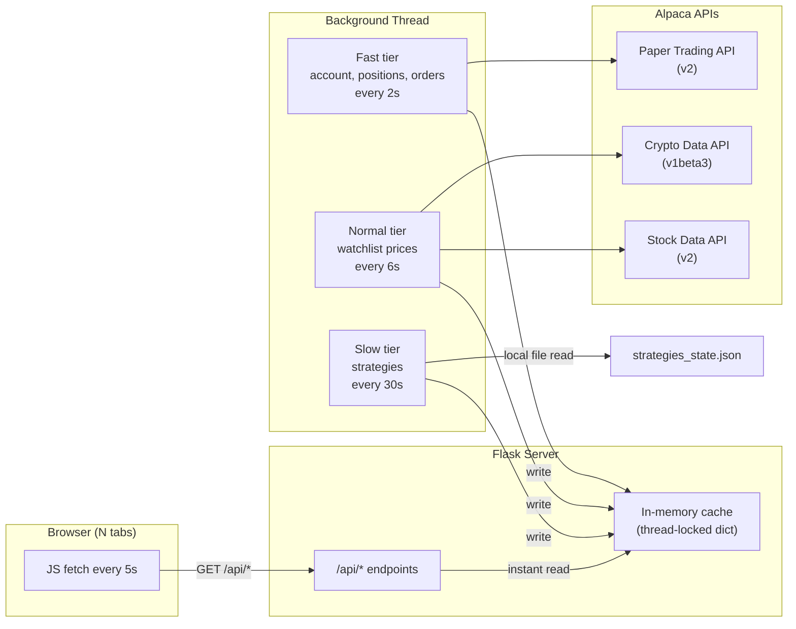
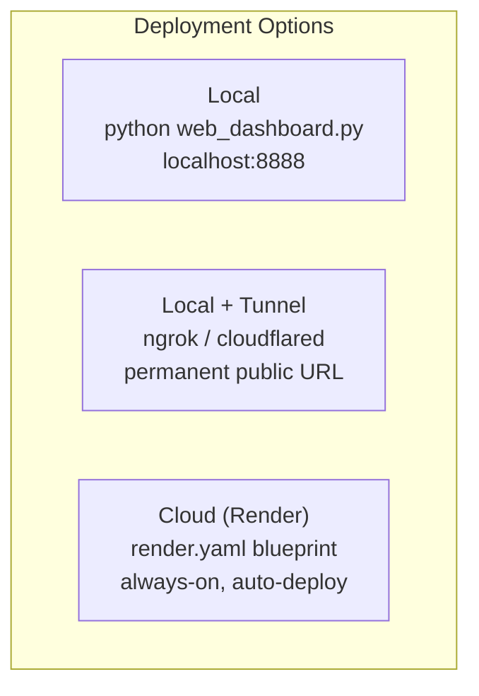
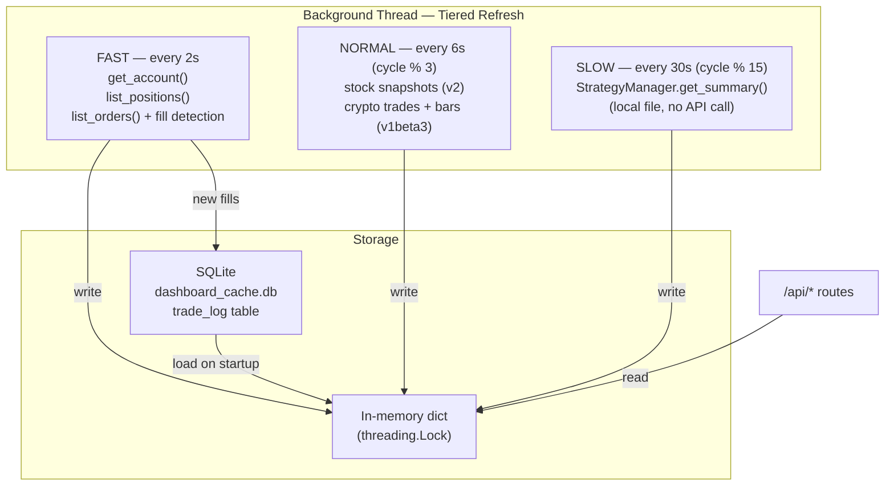

# Alpaca Paper Trading Dashboard

A Bloomberg-style live web dashboard and CLI for paper trading stocks and crypto on [Alpaca Markets](https://alpaca.markets/). Background-cached, multi-strategy, deployable anywhere.

---

## Architecture Overview





---

## Features

- **Live web dashboard** -- 5 draggable, resizable panels with GitHub Dark HC theme
- **Background cache** -- single thread fetches Alpaca data; N browser tabs share one set of API calls
- **Tiered refresh** -- 2s / 6s / 30s tiers stay under Alpaca's 200 calls/min limit
- **SQLite trade log** -- persists fills across restarts
- **6 built-in strategies** -- Grid, DCA, Momentum, Mean Reversion, Dip Buyer, Momentum Scalper
- **Full CLI** -- `alpaca` Click command with market/limit/stop/bracket orders, positions, analytics
- **Stocks and crypto** -- separate API paths for equities (v2) and crypto (v1beta3)
- **Auto-reload** -- `--reload` flag watches `.py`/`.json` files; tunnel stays alive through restarts
- **Paper only** -- hardcoded to `paper-api.alpaca.markets` for safety

---

## Quick Start

### 1. Local only

```bash
git clone https://github.com/serenakeyitan/alpaca-papertrading-CLI.git
cd alpaca-papertrading-CLI/skills/paper-trade
python3 -m venv .venv
.venv/bin/pip install -e .
.venv/bin/pip install flask waitress alpaca-trade-api requests

# Configure API keys (free at https://app.alpaca.markets/paper/dashboard/overview)
alpaca configure init

# Launch dashboard
python web_dashboard.py --port 8888
# Open http://localhost:8888
```

### 2. Local + permanent link (ngrok)

```bash
# One-time: claim a free static ngrok domain
bash scripts/setup-link.sh

# Start dashboard with tunnel
bash scripts/start-web.sh
# Outputs a permanent https://*.ngrok-free.app URL
```

If ngrok is not configured, the start script falls back to a temporary Cloudflare tunnel automatically.

### 3. Cloud deploy (Render)

No local process needed. The repo includes a `render.yaml` blueprint:

1. Push this repo to GitHub
2. Go to [render.com](https://render.com) -- New + -- Blueprint -- select the repo
3. Set `ALPACA_API_KEY` and `ALPACA_SECRET_KEY` when prompted
4. Click Apply -- deploys on the free plan, auto-redeploys on every `git push`

Your dashboard is live at `https://alpaca-dashboard-xxxx.onrender.com`.

---

## Dashboard

### Panels

| # | Panel | Contents |
|---|-------|----------|
| 1 | **Account** | Equity, cash, buying power, day P&L, strategy P&L, market status |
| 2 | **Positions** | Open positions with qty, entry price, current price, unrealized P&L, total row |
| 3 | **Watchlist** | Tracked symbols with live price, daily change %, inline sparkline |
| 4 | **Open Orders** | Pending orders with type, side, qty, limit/stop prices, submitted time |
| 5 | **Trade Log** | Chronological fill log (last 100 entries), persisted in SQLite |

All panels are drag-to-swap and resizable. Layout is saved to `localStorage`.

### API Endpoints

| Endpoint | Returns |
|----------|---------|
| `GET /` | Full HTML dashboard (single-page, no build step) |
| `GET /api/account` | Equity, cash, buying power, P&L, market status, strategy summary |
| `GET /api/positions` | Open positions with unrealized P&L |
| `GET /api/watchlist` | Watchlist symbols with latest price and daily change % |
| `GET /api/orders` | Open orders |
| `GET /api/log` | Recent trade log entries (last 100) |
| `GET /api/strategies` | All strategies with status, P&L, fills |
| `GET /api/bars/<symbol>` | 1-min OHLCV bars (stocks or crypto via path) |

All endpoints serve instantly from the in-memory cache. Zero Alpaca API calls are made on request.

### Auto-Refresh Behavior

The browser calls every `/api/*` endpoint every 5 seconds via `setInterval`. The background thread updates the cache on a tiered schedule (see Architecture below), so the browser always reads the latest cached snapshot. Multiple tabs do not multiply API calls.

---

## Architecture



**Key design decisions:**

- **Single writer** -- one background thread owns all Alpaca API calls. The Flask process never calls Alpaca directly on a request.
- **Thread-safe reads** -- `_DataCache.get()` acquires a lock, copies the value, and returns. Response time is sub-millisecond.
- **SQLite persistence** -- the trade log survives process restarts. On startup, the last 200 entries are loaded from `dashboard_cache.db`.
- **Atomic updates** -- each tier writes its results under the lock in one batch, so the browser never sees a half-updated state.
- **Auto-reload** -- when run with `--reload`, the server watches for file changes and restarts the child process. The tunnel (ngrok/cloudflared) binds to the port, not the PID, so the public URL survives reloads.

---

## Trading Strategies

| Strategy | Description | Key Parameters |
|----------|-------------|----------------|
| **Grid** | Places buy/sell limit orders at fixed intervals around a center price | `symbol`, `grid_size`, `grid_spacing`, `order_qty` |
| **DCA** | Dollar-cost averaging -- periodic fixed-amount market buys | `symbol`, `amount`, `interval` |
| **Momentum** | Buys on upward trends, sells on reversals | `symbol`, `lookback`, `threshold` |
| **Mean Reversion** | Buys below rolling average, sells above | `symbol`, `window`, `deviation` |
| **Dip Buyer** | Buys on significant price dips | `symbol`, `dip_pct`, `qty` |
| **Momentum Scalper** | Short-term momentum entries and exits | `symbol`, `qty`, `gain_target` |

Strategies are managed by `StrategyManager` and persisted in `strategies_state.json`. Auto-tick via cron:

```bash
# Run every 30 seconds (two crontab entries):
* * * * * /path/to/.venv/bin/python /path/to/scripts/auto-tick.py
* * * * * sleep 30 && /path/to/.venv/bin/python /path/to/scripts/auto-tick.py
```

---

## Configuration

### Environment variables (cloud / CI)

| Variable | Required | Description |
|----------|----------|-------------|
| `ALPACA_API_KEY` | Yes | Alpaca paper trading API key |
| `ALPACA_SECRET_KEY` | Yes | Alpaca paper trading secret key |
| `PORT` | No | Server port (default `8888`, Render sets this automatically) |

### Config file (local development)

The CLI stores keys at `~/.alpaca-cli/config.json`:

```json
{
  "api_key": "PK...",
  "secret_key": "..."
}
```

Set interactively with `alpaca configure init`, or copy `config.example.json` into the skill directory.

**Precedence:** environment variables > `skills/paper-trade/config.json` > `~/.alpaca-cli/config.json`.

---

## Rate Limits

Alpaca's paper trading API allows **200 calls per minute**. The tiered refresh system is designed to stay safely under that ceiling:

| Tier | Interval | Endpoints hit | Calls per cycle | Cycles/min | Calls/min |
|------|----------|---------------|-----------------|------------|-----------|
| Fast | 2s | `get_account`, `list_positions`, `list_orders`, `list_orders(closed)`, fill detection | ~5 | 30 | ~150 |
| Normal | 6s | Stock snapshots, crypto latest trades, crypto daily bars | ~3 | 10 | ~30 |
| Slow | 30s | `StrategyManager` (local file read, no API call) | 0 | 2 | 0 |
| | | | | **Total** | **~180** |

This leaves ~20 calls/min of headroom for CLI commands (`alpaca orders market ...`, etc.) running in parallel.

On transient errors, the cache keeps serving the last successful data -- the dashboard never shows an error to the user unless no data has been fetched yet.

---

## License

MIT
